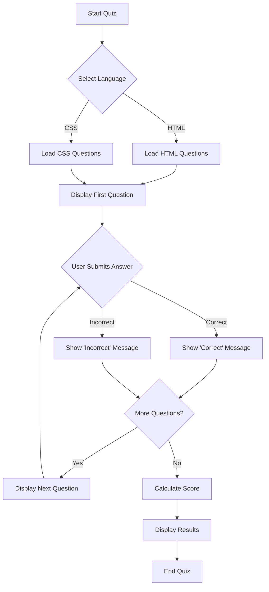

# 🎉 Quiz App

Welcome to the **Quiz App**! This interactive application allows users to test their knowledge across various domains. With questions on HTML, CSS, and more, it’s a great tool for both learning and entertainment.Quiz App outlines the user experience from start to finish. The quiz begins with the user selecting a category, such as HTML or CSS, which determines the set of questions that will be loaded from the corresponding JSON files. Once the questions are loaded, the app displays them one by one, allowing the user to submit their answers. After each submission, the app provides immediate feedback, indicating whether the answer was correct or incorrect. The process continues until all questions have been answered. Finally, the app calculates the user's score and displays the results, marking the end of the quiz.

## 📜 Table of Contents

- [Features](#-features)
- [Project Structure](#-project-structure)
- [Technologies Used](#-technologies-used)
- [How to Use](#-how-to-use)
- [Customization](#-customization)
- [Contributing](#-contributing)
- [License](#-license)
- [Contact](#-contact)

## 🚀 Features

- **Dynamic Categories**: Users can choose from different categories like HTML and CSS.
- **Interactive Interface**: Easy-to-use UI with a live question count, a timer, and feedback on answers.
- **Multiple Language Support**: Focuses on HTML and CSS with the flexibility to add more topics.
- **Real-Time Scoring**: See how well you’re doing with instant feedback after each question.

## 📂 Project Structure

Here's a breakdown of the files and directories within this project:

```bash
Quiz-app/
├── LICENSE                     # License file under GPL
├── index.html                  # Main HTML structure of the quiz app
├── main.js                     # JavaScript file that handles quiz logic and interactions
├── style.css                   # CSS file for styling the quiz interface
├── the_css_questions.json      # JSON file containing CSS questions for the quiz
└── the_html_questions.json     # JSON file containing HTML questions for the quiz
```

### File Details:

- **LICENSE**: The project is licensed under the GNU General Public License (GPL). This means that anyone is free to use, modify, and distribute this software as long as they adhere to the GPL terms.
- **index.html**: The main entry point of the app. It structures the layout of the quiz, including where the questions, answers, and buttons are displayed.
- **main.js**: Contains the core logic of the quiz, including loading questions, handling user input, checking answers, and updating the UI.
- **style.css**: Provides the visual styling for the app, ensuring that it looks good and is easy to navigate.
- **the_css_questions.json**: A JSON file containing an array of CSS-related questions and answers. These are loaded dynamically into the quiz.
- **the_html_questions.json**: Similar to the CSS file, but for HTML questions.

## 💻 Technologies Used

- **HTML5**: For structuring the web page.
- **CSS3**: To style the application and make it visually appealing.
- **JavaScript (ES6+)**: Handles the dynamic behavior of the quiz, including question logic and user interactions.
- **JSON**: For storing and retrieving quiz questions.

## 🎯 How to Use

1. **Clone the repository**:
   ```bash
   git clone https://github.com/abhish-dev/Quiz-app.git
   ```
2. **Navigate to the project directory**:
   ```bash
   cd Quiz-app
   ```
3. **Open the `index.html` file** in your preferred web browser.
4. **Select a category** (HTML or CSS) and start the quiz.
5. **Answer the questions** and submit your answers using the "Send Answer" button.
6. **View your results** at the end of the quiz.


This flowchart illustrates the flow of your Quiz App, including question selection, user interaction, and result display:



### Explanation:

- **Start Quiz**: The quiz begins when the user starts the application.
- **Select Language**: The user selects the category (HTML or CSS).
- **Load Questions**: Based on the selected category, the appropriate JSON file is loaded.
- **Display First Question**: The first question of the selected category is displayed.
- **User Submits Answer**: The user submits their answer, and the app checks whether it is correct or incorrect.
- **Correct/Incorrect**: Depending on the user's answer, a message is shown.
- **More Questions**: The app checks if there are more questions in the selected category.
  - If **Yes**: The next question is displayed.
  - If **No**: The app calculates the user's score.
- **Display Results**: The final results are shown, indicating the user's performance.
- **End Quiz**: The quiz ends after displaying the results.


## 🛠️ Customization

- **Adding More Questions**: To add more questions, simply edit or create new JSON files in the format used in `the_html_questions.json` and `the_css_questions.json`.
- **Expanding Topics**: You can add more topic-specific JSON files (e.g., `the_js_questions.json`) and modify the JavaScript logic in `main.js` to support additional categories.
- **Styling**: Modify `style.css` to change the look and feel of the quiz. Customize colors, fonts, layouts, and more to match your personal or brand style.

## 🤝 Contributing

We welcome contributions to the Quiz App! Whether you find a bug, have a great feature idea, or just want to improve the documentation, feel free to fork the repository and submit a pull request.

### Steps to Contribute:

1. **Fork the repository**.
2. **Create a new branch** for your changes.
   ```bash
   git checkout -b feature/new-feature
   ```
3. **Make your changes** and commit them.
   ```bash
   git commit -m "Add a new feature"
   ```
4. **Push to your fork**.
   ```bash
   git push origin feature/new-feature
   ```
5. **Submit a pull request** to the main repository.

## 📄 License

This project is licensed under the GNU General Public License (GPL), which means you are free to use, modify, and distribute this software as long as your contributions are also licensed under the GPL. See the [LICENSE](LICENSE) file for more details.

## 📞 Contact

If you have any questions, suggestions, or feedback, feel free to reach out!

- **GitHub**: [abhish-dev](https://github.com/abhish-dev)

---

